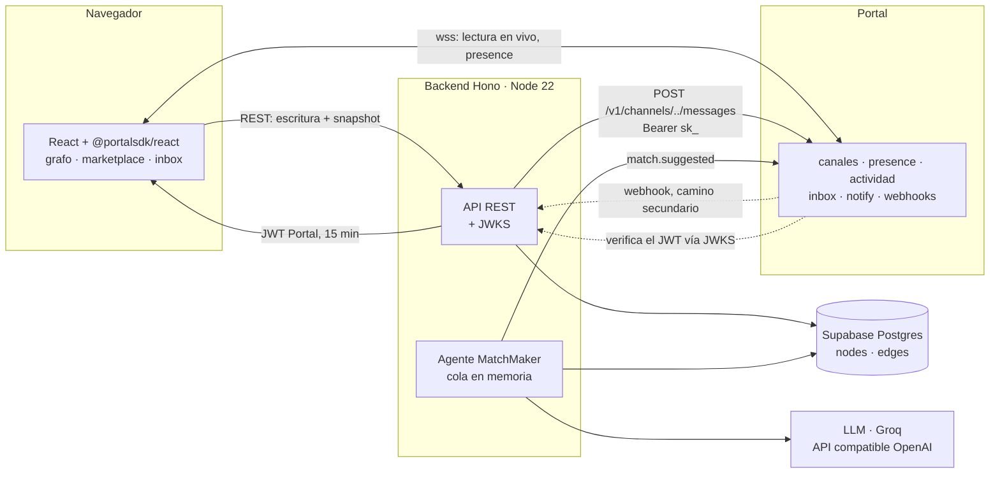
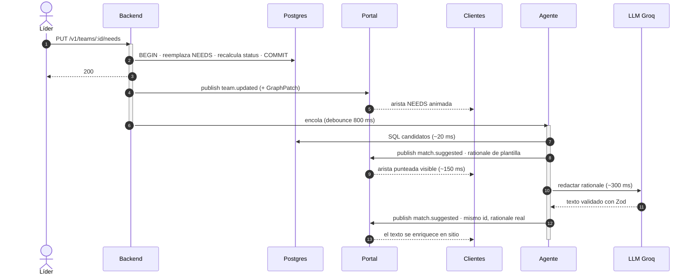
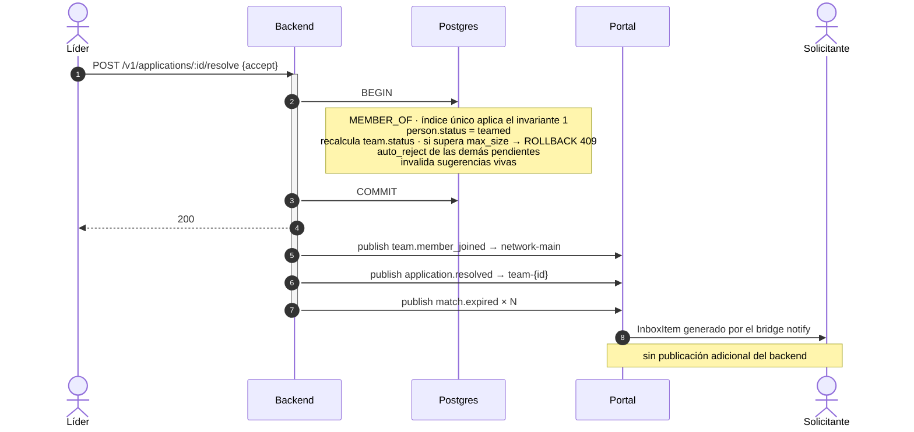

# 07 — Arquitectura

## Vista general



**El backend no tiene ni un solo websocket.** Toda conexión persistente la sostiene Portal. El backend es un servicio HTTP sin estado que puede reiniciarse en cualquier momento sin desconectar a nadie: solo se pierden las publicaciones en vuelo, que quedan registradas en `outbox`.

Consecuencia práctica: escala vertical/horizontalmente sin sesiones pegajosas, y un `deploy` no tira a los usuarios.

## Módulos

```
src/
  contracts/        ← @nodo/contracts: sobres, DTOs, tipos de grafo. Compartido con el frontend.
  db/               ← esquema, migraciones, queries tipadas
  domain/           ← invariantes y máquinas de estado. Sin HTTP, sin Portal.
  portal/           ← cliente de publicación, emisión de JWT, verificación de webhook
  agent/            ← scoring, prompts, cola, guardarraíles. matchmaker y quizmaster.
  board/            ← notas, votos, reacciones. Sin websockets: el "durante" no pasa por aquí.
  quiz/             ← definición, partida, puntuación, avance idempotente
  http/             ← rutas Hono, validación Zod, mapeo de errores
  jobs/             ← caducidad de sugerencias, drenaje de outbox, barrido de partidas
```

Regla de dependencias: `domain` no importa `portal` ni `http`. Los invariantes se prueban sin levantar nada.

Dos módulos exponen su dependencia externa detrás de una interfaz, no de una implementación concreta: `portal/` publica a través de `PortalPublisher` y `agent/` llama al modelo a través de `LlmProvider`. Son las dos costuras que hacen sustituibles a Portal y al proveedor de LLM — en pruebas ([10](10-testing.md)) y en producción ([ADR-007](01-decisions.md#adr-007--capa-de-llm-intercambiable)).

`board/` y `quiz/` no añaden costuras. **Siguen sin existir websockets en el backend**: el tablero recibe estado por HTTP y publica por `PortalPublisher`, y el reto no tiene reloj propio porque el plazo es un dato ([ADR-012](01-decisions.md#adr-012--el-plazo-del-reto-es-un-dato-no-un-temporizador)). El principio rector sobrevive a los dos features sin excepciones.

`quizmaster` vive dentro de `agent/` y comparte el `LlmProvider` con el matchmaker. Es un actor de dominio más, no una segunda integración.

## Secuencia — caso de uso principal

El del criterio AC-02: un equipo publica una necesidad y el grafo revela quién la cubre.



**Tiempo hasta que se mueve el grafo: ~150 ms.** El texto del agente llega a ~1 s. Nadie percibe latencia.

## Secuencia — aceptar una solicitud



Las tres publicaciones van después del commit. Si una falla, cae a `outbox`; el estado en Postgres ya es correcto.

## Consistencia y reconexión

| Situación | Qué pasa |
|---|---|
| Cliente conecta por primera vez | `GET /v1/graph` → `seq` → suscribe → aplica sobres con `seq` mayor |
| Cliente pierde red 30 s | Portal reconecta y hace backfill (50 mensajes) → suficiente |
| Cliente pierde red 10 min | hueco de `seq` detectado → re-pide snapshot |
| Backend se reinicia | clientes intactos (Portal sostiene los sockets); se pierde la cola en memoria del agente |
| Portal falla al publicar | fila en `outbox`; job reintenta cada 10 s; el estado nunca se corrompe |
| Postgres falla | la escritura falla con 5xx; **no se publica nada**. Sin estados fantasma. |

El orden `commit → publish` garantiza que Portal nunca anuncia algo que Postgres no tiene. La inversa —publicar y que después falle el commit— deja a los clientes con un estado que no existe y no es recuperable automáticamente.

## Riesgos y mitigaciones

| Riesgo | Prob. | Impacto | Mitigación |
|---|---|---|---|
| Bucle de un agente vía webhook | media | **fatal** | filtro `senderId.startsWith('agent:')` como primera línea del handler + `processed_events`. **Por prefijo, no por id exacto**: comparar contra `'agent:matchmaker'` dejaría pasar a `quizmaster` ([12](12-live-quiz.md)) |
| Umbral mal calibrado (sin sugerencias, o exceso de ellas) | **alta** | alto | calibrar contra los datos de semilla; el umbral es una variable de entorno, ajustable sin desplegar |
| Proveedor de LLM lento o caído | media | **bajo** | fallback de plantilla + timeout 4 s; el matching nunca depende del LLM, y cambiar de proveedor son 3 env vars ([ADR-007](01-decisions.md#adr-007--capa-de-llm-intercambiable)) |
| Publicar antes del commit | media | alto | regla única en [05](05-rest-api.md); code review de cada handler |
| `authz` mal configurado: ningún cliente conecta | baja | **fatal** | validar `portal deploy` contra un cliente real antes de construir sobre él |
| Origen no registrado en producción | media | alto | `portal origins add` como paso del despliegue, no manual |
| Grafo ilegible al crecer el número de nodos | media | medio | caducidad de sugerencias, filtrado por categoría y acotado por `Event` ([ADR-013](01-decisions.md#adr-013--space-es-el-contenedor-obligatorio-con-un-espacio-abierto-por-defecto)) |
| Un solicitante ve el tablero del equipo | alta | bajo | `authz` de `team-*` admite `applicant`; aceptado a conciencia ([ADR-015](01-decisions.md#adr-015--el-contrato-se-alinea-con-el-frontend-ya-implementado)) |
| Sobre que excede los 2KB de Portal | media | alto | Portal rechaza la publicación y el evento se pierde. `members` acotado a 8 y tope de participantes del reto ([ADR-014](01-decisions.md#adr-014--members-en-el-sobre-es-una-vista-acotada-membercount-es-la-verdad)) |
| Pregunta generada con la respuesta mal marcada | media | alto | no hay fallback posible: corrompe la selección. El líder aprueba el borrador antes de poder lanzar ([12](12-live-quiz.md#el-borrador-y-su-aprobación)) |
| Partida abandonada que nadie avanza | **alta** | bajo | `expires_at` + barrido cada 5 min, en el job runner que ya existe |

Los dos riesgos marcados **fatal** se verifican antes de construir lógica de producto encima: ambos invalidan el sistema entero, no una funcionalidad.

## Deuda conocida

Asumida de forma deliberada y documentada:

- **Identidad suplantable** — sin contraseña, `sessionToken` en `localStorage` ([ADR-006](01-decisions.md)).
- **Cola en memoria** — un reinicio pierde una tanda de sugerencias.
- **Sin paginación en `/v1/graph`** — correcto hasta ~2.000 nodos.
- **Vocabulario de skills fijo** — no se aprenden tags nuevos en runtime.
- **Sin tests de integración contra Portal** — solo contra la capa de dominio.
- **El webhook no reprocesa el dominio** — `POST /v1/portal/webhooks` descarta el eco del agente y registra `processed_events`, pero no re-dispara el matchmaker. Si el disparo en proceso se pierde, este receptor no lo compensa hoy ([05](05-rest-api.md#webhook-de-portal)).
- **El tablero no tiene historial ni deshacer** — una nota borrada no se recupera. `notes` no lleva borrado lógico.
- **Sin resolución de conflictos en el tablero** — dos personas editando el texto de la misma tarjeta se pisan: gana el último `PATCH`.
- **Sin paginación en el tablero** — el tope de 200 notas es lo que lo mantiene correcto, igual que `/v1/graph` hasta ~2.000 nodos.
- **`onPublish` y `authz` sin prueba automatizada** — corren dentro de Portal. AC-09 es verificación manual ([10](10-testing.md#fuera-de-alcance)).
- **El reto no valida la calidad de las preguntas** — se comprueba la forma (cuatro opciones, un índice correcto), no que la respuesta marcada sea la buena. Esa garantía la aporta el líder al aprobar.
