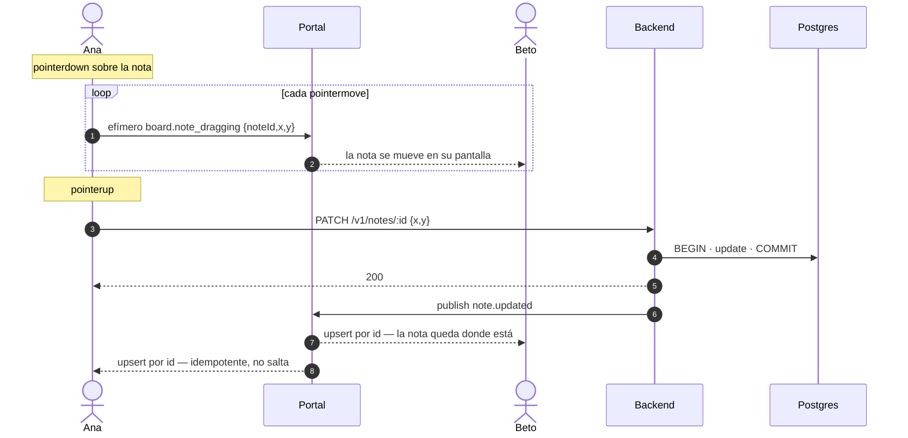

# 11 — Tablero colaborativo

Un equipo que acaba de formarse tiene un `pitch` de una línea y nada más. El tablero es donde ese pitch se convierte en un plan: notas que la gente escribe, mueve, agrupa y vota, en vivo y a la vez.

Es la primera superficie del producto donde **varias personas escriben al mismo tiempo**. Todo lo anterior —perfiles, equipos, solicitudes— lo escribe una persona y el resto lo lee. Eso cambia el reparto de responsabilidades entre el cliente, el backend y Portal, y este documento existe para fijar ese reparto.

## Alcance

Un tablero por equipo, creado con el equipo. Notas de texto sobre un lienzo, con posición, color, votos y reacciones. Cursores en vivo. Sin dibujo libre, sin imágenes, sin conectores.

## La decisión central: el «durante» y el «después»

Arrastrar una nota produce decenas de eventos por segundo. Hacer un `POST` por cada uno es inviable, y publicarlos todos a Portal como estado de dominio saturaría el canal y la base de datos.

El reparto es este, y es lo único de este documento que no se puede cambiar sin rehacer el resto:

| Momento | Qué es | Por dónde viaja | Toca Postgres |
|---|---|---|---|
| **Durante** | cursor, nota en movimiento, «alguien está escribiendo aquí» | efímero cliente → cliente por Portal | **no** |
| **Después** | crear, editar, soltar, votar, reaccionar, borrar | `POST`/`PATCH` REST → commit → publish del backend | **sí** |

**Nada de lo efímero es verdad.** Es previsualización: se pierde al recargar, no tiene `seq`, no entra en el historial y nadie lo reconstruye. La posición real de una nota es la que quedó comprometida en Postgres cuando alguien soltó el botón.

Con eso, [ADR-005](01-decisions.md#adr-005--postgres-es-la-fuente-de-verdad-portal-es-transporte) sobrevive intacto: Postgres sigue siendo la única fuente de verdad. Lo que sí cambia es que **los clientes ganan la capacidad `publish` en este canal y solo en este canal** — ver [ADR-011](01-decisions.md#adr-011--los-clientes-publican-señales-efímeras-en-el-canal-del-tablero).

### Por qué no una Extension de Portal

Portal ofrece *extensions*: instancias durables por canal con `onInit`/`onBatch`/`onSnapshot` y almacenamiento propio, capaces de servir el estado del tablero a quien llega tarde **sin ida y vuelta al backend**. Es tentador y está disponible (`@portalsdk/config@0.2.1` reexporta `@portalsdk/extension-protocol@0.1.0`).

No se usa en v1, por tres razones en orden de peso:

1. El estado del tablero pasaría a vivir en el almacenamiento de la extension: **una segunda fuente de verdad**, que es exactamente lo que ADR-005 existe para impedir.
2. Los lotes llegan *at-least-once* con un `batchSeq` propio, así que trae **una segunda capa de idempotencia** en paralelo a `processed_events`.
3. `@portalsdk/extension-protocol` está en `0.1.0`.

El patrón que sí se usa —snapshot por REST más marca de agua y upsert idempotente por `id`— ya está escrito, probado y desplegado para el grafo. `GET /v1/teams/:id/board` es `GET /v1/graph` con otro `WHERE`.

Queda anotado como evolución posible **solo en el papel de caché de snapshot**, con `onInit` hidratando desde este API. Nunca como autoridad.

## El tablero no entra al grafo público

`NodeKind` no gana `board` ni `note`, y no es por purismo: `frontend/src/hooks/useGraphData.ts` y `frontend/src/utils/graphStyles.ts` construyen `Record<NodeKind, …>` **exhaustivos**, así que añadir un valor rompe la compilación del frontend.

Además es lo correcto por producto: una lluvia de ideas a medio cocer es interna del equipo, no información abierta de la red. El grafo público muestra que el equipo existe y qué le falta; no muestra qué está pensando.

`TeamDTO` gana `boardId` (aditivo) para que el cliente sepa que hay tablero y pueda pedirlo.

## Modelo

```
Board  { id, team_id, created_at }
Note   { id, board_id, author_id, text, x, y, color, z, created_at, updated_at }
Vote   { note_id, person_id }                      -- un voto por persona y nota
React  { note_id, person_id, emoji }               -- un emoji por persona y nota
```

**`Note`, nunca «Idea».** `Idea` ya está tomado en [02](02-domain-model.md) y significa otra cosa: una propuesta de proyecto publicada por una Person, que existe con o sin equipo y es un nodo del grafo. Una nota es un papelito en un lienzo privado. Confundirlas parte el glosario en dos.

Prefijos de id: `brd_`, `note_` ([09](09-contracts.md)).

### Ciclo de vida

Un tablero nace con su equipo, en la misma transacción que crea el nodo, `LEADS`, `MEMBER_OF` y las aristas `NEEDS`. No hay ruta para crearlo aparte: un equipo sin tablero sería un estado que nadie sabe reparar.

Una Idea sin equipo no tiene tablero. Lo gana en el instante en que `SPAWNED` produce el equipo.

Se borra en cascada con el equipo.

## Canal `board-{teamId}`

| | |
|---|---|
| Persistencia | persistente |
| Publican | backend (estado) **y clientes** (solo efímeros) |
| Leen | miembros del equipo |
| `access` | `authz` |

El id lleva el `teamId` dentro por obligación, no por estética: `authz` corre dentro de Portal **sin acceso a la base de datos**, y solo puede leer `ctx.channel.id` y el claim `teams`. Un canal llamado `board-{boardId}` sería imposible de autorizar.

```ts
'board-*': {
  anonymous: false,
  access: 'authz',

  authz: (ctx) => {
    if (ctx.claims.anon) return block('Crea tu perfil para entrar.');
    const teamId = ctx.channel.id.slice('board-'.length);
    const role = (ctx.claims.teams as Record<string, string> | undefined)?.[teamId];
    // Solo miembros. Un solicitante puede leer team-{id}, pero no el tablero:
    // el plan del equipo no es material de reclutamiento.
    if (role !== 'member') return block('Solo el equipo puede ver este tablero.');
    return allow({ publish: true, sendDirect: false, isMember: true });
  },

  // `publish: true` abre la puerta a que un cliente publique cualquier cosa.
  // Este middleware es el que la cierra: solo efímeros, solo de la lista.
  onPublish: [
    defineMiddleware('publish', (ctx) => {
      if (!ctx.message.ephemeral) {
        return block('El estado del tablero se escribe por la API, no por el canal.');
      }
      const allowed = ['board.cursor', 'board.note_dragging', 'board.note_focus'];
      if (!allowed.includes(ctx.message.type)) return block('Tipo no permitido.');
      return allow();
    }),
  ],
},
```

Los sobres del tablero **no llevan `graph`**: se construyen con `TeamEnvelope`, que lo prohíbe en tiempo de compilación ([ADR-010](01-decisions.md#adr-010--el-sobre-distingue-eventos-de-grafo-de-eventos-de-canal-privado)).

### Mensajes efímeros — publica el cliente

Ninguno se persiste, ninguno tiene `seq`, ninguno entra en el historial. Siguen el patrón que Portal documenta para cursores en vivo.

| `type` | `content` | Cadencia |
|---|---|---|
| `board.cursor` | `{ x, y }` | cada `pointermove` |
| `board.note_dragging` | `{ noteId, x, y }` | cada `pointermove` mientras se arrastra |
| `board.note_focus` | `{ noteId \| null }` | al entrar o salir de una nota |

Además, `setMetadata({ cursor })` **throttleado a 250 ms** como respaldo: quien llega tarde recibe el metadata de presencia en el frame de conexión y ve los cursores sin esperar al primer movimiento.

`content` de un mensaje de Portal es **≤2KB**. Ninguno de estos se acerca; los tres son de decenas de bytes.

### Mensajes persistentes — publica el backend

| `type` | Payload |
|---|---|
| `note.created` | `{ note: NoteDTO }` |
| `note.updated` | `{ note: NoteDTO }` |
| `note.deleted` | `{ noteId }` |
| `note.voted` | `{ noteId, personId, votes }` |
| `note.reacted` | `{ noteId, personId, emoji, reactions }` |

`votes` y `reactions` viajan ya agregados para que el cliente no lleve la cuenta: es lo que hace la reaplicación idempotente cuando Portal entrega dos veces.

## Datos

```sql
create table boards (
  id          text primary key,
  team_id     text not null unique references teams(id) on delete cascade,
  created_at  timestamptz not null default now()
);

create table notes (
  id          text primary key,
  board_id    text not null references boards(id) on delete cascade,
  author_id   text not null references people(id),
  text        text not null default '',
  x           real not null,
  y           real not null,
  z           int  not null default 0,
  color       text not null default 'yellow'
                check (color in ('yellow','green','blue','pink','purple','gray')),
  created_at  timestamptz not null default now(),
  updated_at  timestamptz not null default now()
);

create index notes_board_idx on notes (board_id);

-- Un voto por persona y nota. El segundo voto es un toggle, no un error.
create table note_votes (
  note_id     text not null references notes(id) on delete cascade,
  person_id   text not null references people(id) on delete cascade,
  created_at  timestamptz not null default now(),
  primary key (note_id, person_id)
);

-- Un emoji por persona y nota: reaccionar de nuevo reemplaza.
create table note_reactions (
  note_id     text not null references notes(id) on delete cascade,
  person_id   text not null references people(id) on delete cascade,
  emoji       text not null,
  created_at  timestamptz not null default now(),
  primary key (note_id, person_id)
);
```

`boards.team_id` es `unique`: la relación 1:1 se aplica en la base de datos, no en la capa de servicio. Un invariante que solo vive en el código no es un invariante ([02](02-domain-model.md#invariantes)).

## Rutas

```http
GET    /v1/teams/:id/board          [auth: miembro]   snapshot completo
POST   /v1/boards/:id/notes         [auth: miembro]   { text, x, y, color? }
PATCH  /v1/notes/:id                [auth: miembro]   { text?, x?, y?, color?, z? }
DELETE /v1/notes/:id                [auth: autor o líder]
POST   /v1/notes/:id/vote           [auth: miembro]   toggle
POST   /v1/notes/:id/react          [auth: miembro]   { emoji }
```

`GET /v1/teams/:id/board` → `200 { board, notes, seq }`.

Mismo contrato que `GET /v1/graph` y por la misma razón: el `seq` es la marca de agua de `board-{teamId}` en el momento del snapshot, y **se lee antes que las notas**. Al revés, una publicación colada entre ambas lecturas produciría un parche que el cliente descarta por `seq` y que el snapshot no traía.

`channel_watermarks` ya es una tabla por canal ([ADR-009](01-decisions.md#adr-009--la-marca-de-agua-seq-es-la-de-network-main)), así que no necesita cambios: cada `board-{teamId}` es una fila más.

`PATCH /v1/notes/:id` es la ruta que recibe el «soltar». Se llama una vez, al terminar el arrastre — nunca durante.

## Secuencia — mover una nota



Que el paso final sea un upsert por `id` es lo que evita el salto visual: Ana ya tenía la nota ahí, y reaplicar el mismo estado no la mueve.

## Límites y guardarraíles

| # | Regla | Cómo se aplica |
|---|---|---|
| 1 | Solo miembros entran al tablero | `authz`, `role !== 'member'` bloquea |
| 2 | Un cliente solo publica efímeros de la lista blanca | `onPublish`, primer middleware que no hace `allow()` corta |
| 3 | Un voto por persona y nota | clave primaria compuesta |
| 4 | Un emoji por persona y nota | clave primaria compuesta; reaccionar de nuevo reemplaza |
| 5 | Borra el autor o el líder | comprobado en el handler → `403 FORBIDDEN` |
| 6 | Máx. 200 notas por tablero | validación en transacción → `409 BOARD_FULL` |
| 7 | Texto de nota ≤ 500 caracteres | Zod en el borde → `422 VALIDATION_ERROR` |

El límite 6 no es arbitrario: un tablero de 200 notas son unos 40 KB de JSON en `GET /v1/teams/:id/board`, del mismo orden que el snapshot del grafo. Más allá, habría que paginar.

## Criterios de aceptación

**AC-07 — Arrastre en vivo sin escritura**
> **Dado** dos miembros con el mismo tablero abierto
> **Cuando** uno arrastra una nota sin soltarla
> **Entonces** el otro ve la nota moverse
> **Y** no se escribe ni una fila en `notes`.

**AC-08 — El soltar es lo que persiste**
> **Dado** el arrastre anterior
> **Cuando** el primero suelta la nota
> **Entonces** `PATCH /v1/notes/:id` deja la posición comprometida
> **Y** se publica `note.updated`
> **Y** un tercero que abre el tablero por primera vez la ve en esa posición.

**AC-09 — El canal no acepta estado**
> **Dado** un cliente conectado a `board-{teamId}`
> **Cuando** intenta publicar un mensaje **no** efímero
> **Entonces** Portal lo rechaza por `onPublish`
> **Y** no se escribe nada en Postgres.

AC-09 es la que protege [ADR-011](01-decisions.md#adr-011--los-clientes-publican-señales-efímeras-en-el-canal-del-tablero): sin ella, `publish: true` sería una puerta abierta a inyectar estado falso.

## Pruebas

Al nivel de **servicio**, con el doble de Portal de [10](10-testing.md): sembrar equipo y miembros, ejecutar cada handler y afirmar sobre el canal, el `type` y la ausencia de `graph` en el sobre.

`onPublish` y `authz` **no se prueban automáticamente** — corren dentro de Portal. AC-09 es verificación manual con un cliente real, en la misma lista que `authz` de [10](10-testing.md#fuera-de-alcance).
