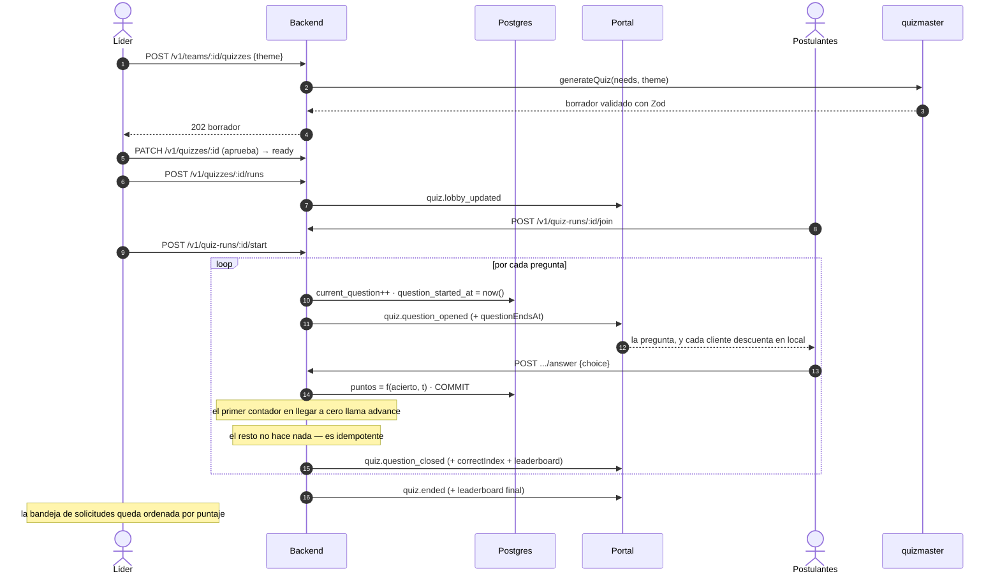

# 12 — Reto en vivo (quiz)

Un equipo con hueco y una necesidad concreta —«nos falta alguien de Go»— recibe cinco solicitudes y no tiene forma de distinguirlas. El perfil dice `go`; el reto muestra quién sabe Go.

El reto es un quiz sincrónico al estilo Kahoot: mismas preguntas, mismo plazo, todos a la vez, ranking recalculado entre preguntas. Es el segundo sitio del producto donde el tiempo real es la funcionalidad y no el transporte.

## Alcance

El líder lanza un reto sobre uno o varios `NEEDS` del equipo. Los solicitantes con solicitud `pending` entran al lobby. El líder arranca. Todos ven la misma pregunta durante el mismo plazo. Al final hay un ranking, y ese ranking **ordena la bandeja de solicitudes**.

No decide nada por sí solo. Ver «El ranking no acepta a nadie».

## El principio que lo gobierna todo

> **El plazo es un dato, no un temporizador.**

El backend no sostiene conexiones de tiempo real y puede reiniciarse en cualquier momento (README, principio rector). Un reloj que avanza preguntas viviría en el proceso, y un redespliegue a mitad de partida la mataría.

Portal tampoco puede sostenerlo: sus *extensions* son instancias durables, pero sus cuatro handlers —`onInit`, `onBatch`, `onSnapshot`, `onShutdown`— son **todos reactivos**, y `ExtensionContext.storage` expone únicamente `get`/`put`/`delete`/`list`. No hay alarma ni handler al que despertarla.

Así que no hay temporizador en ninguna parte:

1. Al abrir una pregunta, el backend escribe `question_started_at` y publica `questionEndsAt` (epoch ms) en el sobre.
2. Cada cliente descuenta **en local** desde ese valor. La cuenta atrás es presentación.
3. El backend acepta una respuesta solo si, **contra su propio reloj**, `now <= questionEndsAt`. El cliente no es de fiar.
4. El avance lo dispara `POST /v1/quiz-runs/:id/advance`, **idempotente**, guardado por `current_question`. Lo invoca el líder o el primer cliente cuyo contador llegue a cero — da igual cuál, porque el segundo no hace nada.

Consecuencia: un reinicio del backend no interrumpe la partida. El estado está en Postgres y el siguiente `advance` la continúa. Ver [ADR-012](01-decisions.md#adr-012--el-plazo-del-reto-es-un-dato-no-un-temporizador).

## Modelo

Dos entidades, no una. La definición se reutiliza; la partida no.

```
Quiz      { id, team_id, need_slugs[], title, status, created_at }
Question  { id, quiz_id, position, prompt, options[4], correct_index, seconds }
QuizRun   { id, quiz_id, team_id, mode, status,
            current_question, question_started_at, started_at, ended_at, expires_at }
Entry     { run_id, person_id, score, answered_count, joined_at, left_at }
Answer    { id, run_id, person_id, question_id, choice, received_at, points }
```

| Término | Definición |
|---|---|
| **Quiz** | Conjunto de preguntas anclado a los `NEEDS` de un equipo. Se redacta una vez y sirve para varias partidas. |
| **QuizRun** | Una partida concreta, con sus participantes y su reloj. |
| **Entry** | La participación de una persona en una partida. Guarda su puntaje acumulado. |

Prefijos: `quiz_`, `qst_`, `run_`, `ans_` ([09](09-contracts.md)).

`Quiz.status` ∈ `draft` · `ready`. Un `draft` no se puede lanzar: es el borrador del agente antes de que el líder lo apruebe.

`QuizRun.status` ∈ `lobby` · `running` · `ended` · `abandoned`.

## Quién escribe las preguntas

Las genera **`quizmaster`**, un actor de dominio nuevo.

### `quizmaster` es un actor, no una credencial

Dos cosas comparten la palabra «agente» en este proyecto y conviene no confundirlas:

| | Qué es | Cuántas hay |
|---|---|---|
| `LlmProvider` | la costura técnica hacia el modelo ([ADR-007](01-decisions.md#adr-007--capa-de-llm-intercambiable)) | **una, siempre** |
| Agent | actor del dominio: nodo del grafo, `actor.kind: 'agent'`, aparece en el feed | dos: `matchmaker`, `quizmaster` |

`quizmaster` **no trae credenciales nuevas**. Usa la misma `LLM_API_KEY`, el mismo `LLM_BASE_URL` y el mismo `LLM_MODEL`. Lo único que se añade es un tercer método a una interfaz interna que hoy tiene dos:

```ts
// apps/api/src/agent/llm.ts — no está en @nodo/contracts, así que el
// contrato con el frontend no se toca en absoluto.
export interface LlmProvider {
  extractSkills(text: string): Promise<Array<{ slug: string; confidence: number }>>;
  writeRationale(input: RationaleInput): Promise<string>;
  generateQuiz(input: QuizInput): Promise<QuizDraft>;   // nuevo
}
```

Es un actor separado y no una capacidad más del MatchMaker porque [06](06-matchmaker-agent.md) abre declarando que el agente hace **una sola cosa** extremadamente bien. `agent` ya es un `NodeKind` válido, así que un segundo nodo `agent` no toca el enum ni rompe la compilación del frontend.

### Requisito: el guardarraíl anti-bucle se ensancha

`webhook.ts` compara hoy `senderId === 'agent:matchmaker'`. Con un segundo agente publicando, ese filtro **lo dejaría pasar**, y es el riesgo que [07](07-architecture.md#riesgos-y-mitigaciones) marca como *fatal*.

```ts
// Antes
if (evt.data?.senderId === 'agent:matchmaker') return c.body(null, 204);
// Después
if (evt.data?.senderId?.startsWith('agent:')) return c.body(null, 204);
```

No es una nota al pie: es condición para desplegar este documento.

### El borrador y su aprobación

El líder indica la temática y, si quiere, algunas preguntas concretas. `quizmaster` completa el resto desde los `NEEDS`.

```
System:
Escribes preguntas de opción múltiple para evaluar una habilidad técnica concreta.

- {count} preguntas. Cada una con exactamente 4 opciones y una sola correcta.
- Enunciado ≤ 160 caracteres. Cada opción ≤ 60 caracteres.
- Dificultad de práctica real, no de trivia ni de sintaxis memorizada.
- Nada ambiguo: dos opciones defendibles invalidan la pregunta.
- Escribe en {language}.

Habilidad: {label} ({slug}) · Temática: {theme}
Preguntas que el líder ya redactó: {seedQuestions}

User:
Genera las que faltan.
```

Salida JSON validada con Zod: cuatro opciones, `correctIndex` entre 0 y 3, sin duplicados.

**El líder aprueba antes de poder lanzar.** Un `Quiz` en `draft` no admite partidas. A diferencia del `rationale` del MatchMaker, aquí **no hay fallback de plantilla posible**: una pregunta mal generada no degrada la calidad de un texto, corrompe la selección. La aprobación es una sola acción —el líder ve el borrador, edita lo que quiera y pulsa lanzar—, no una revisión pregunta a pregunta.

Si el modelo falla o no pasa la validación, no hay quiz. Es el comportamiento correcto: mejor sin reto que con un reto que mide ruido.

## Puntuación

Determinista, sin LLM, igual que el score del MatchMaker:

```
puntos = 0                              si la respuesta es incorrecta, o llega tarde
puntos = 500 + 500 · (1 − t / T)        si es correcta

  t = ms entre question_started_at y la recepción en el servidor
  T = duración de la pregunta en ms
```

Máximo 1000 por pregunta; una respuesta correcta justo en la bocina vale 500. Acertar pesa el doble que la velocidad, que es lo que se quiere medir.

`t` se toma **al recibir en el servidor**, nunca del cliente. Los ~100 ms de latencia de red son ruido en una pregunta de 20 segundos, y afectan a todos por igual.

## Las respuestas no viajan por el canal

`POST /v1/quiz-runs/:id/answer`, siempre. Nunca un mensaje de Portal.

Dos razones, ambas duras:

- El `content` de un mensaje lo reciben **todos los suscriptores del canal**. Una respuesta publicada sería visible para los rivales.
- Por la misma razón, **la respuesta correcta nunca viaja en el sobre de la pregunta**. `QuestionDTO` publicado no tiene `correctIndex`. Solo lo tiene la fila en Postgres.

El canal transporta dos cosas y nada más: la pregunta actual y el ranking.

## Canal `quiz-{teamId}-{runId}`

El `teamId` va dentro del id del canal por obligación: `authz` corre en Portal **sin base de datos** y no puede traducir un `runId` a un equipo.

```ts
'quiz-*': {
  anonymous: false,
  access: 'authz',
  mode: 'broadcast',

  authz: (ctx) => {
    if (ctx.claims.anon) return block('Crea tu perfil para entrar.');
    // "quiz-{teamId}-{runId}" → el teamId es el segmento del medio.
    const rest = ctx.channel.id.slice('quiz-'.length);
    const teamId = rest.slice(0, rest.lastIndexOf('-'));
    const role = (ctx.claims.teams as Record<string, string> | undefined)?.[teamId];
    if (!role) return block('No participas en este reto.');
    // Nadie publica: las respuestas van por REST.
    return allow({ publish: false, isMember: role === 'member' });
  },
}
```

`mode: 'broadcast'` porque el patrón es uno-a-muchos y el modo es **inmutable una vez creado el canal**. En broadcast, `sendActivity`/`sendTyping` son no-op — aquí no se usan.

Miembros y solicitantes entran: el claim `teams` ya marca `applicant` a quien tiene una solicitud `pending`, así que el lobby no necesita autorización propia.

### Sobres

| `type` | Payload |
|---|---|
| `quiz.lobby_updated` | `{ runId, participants: PersonRef[] }` |
| `quiz.started` | `{ runId, questionCount }` |
| `quiz.question_opened` | `{ runId, position, question: QuestionDTO, questionEndsAt }` |
| `quiz.question_closed` | `{ runId, position, correctIndex, leaderboard: LeaderboardRow[] }` |
| `quiz.ended` | `{ runId, leaderboard: LeaderboardRow[] }` |

`QuestionDTO` **no incluye `correctIndex`**. Aparece por primera vez en `quiz.question_closed`, cuando ya no sirve para hacer trampa.

`leaderboard` viaja completo en cada cierre de pregunta. Con el tope de participantes (abajo) cabe de sobra en los 2KB de Portal.

Estos sobres **no llevan `graph`**: se construyen con `TeamEnvelope`.

## Datos

```sql
create table quizzes (
  id          text primary key,
  team_id     text not null references teams(id) on delete cascade,
  need_slugs  text[] not null,
  title       text not null,
  status      text not null default 'draft' check (status in ('draft','ready')),
  created_at  timestamptz not null default now()
);

create table questions (
  id            text primary key,
  quiz_id       text not null references quizzes(id) on delete cascade,
  position      int  not null,
  prompt        text not null,
  options       text[] not null check (array_length(options, 1) = 4),
  correct_index int  not null check (correct_index between 0 and 3),
  seconds       int  not null default 20,
  unique (quiz_id, position)
);

create table quiz_runs (
  id                  text primary key,
  quiz_id             text not null references quizzes(id) on delete cascade,
  team_id             text not null references teams(id) on delete cascade,
  mode                text not null default 'live' check (mode in ('live','solo')),
  status              text not null default 'lobby'
                        check (status in ('lobby','running','ended','abandoned')),
  current_question    int,
  question_started_at timestamptz,
  started_at          timestamptz,
  ended_at            timestamptz,
  expires_at          timestamptz not null,
  created_at          timestamptz not null default now()
);

-- Una sola partida viva por quiz: dos a la vez repartirían a los solicitantes.
create unique index one_live_run_per_quiz
  on quiz_runs (quiz_id) where status in ('lobby','running');

-- Barrido de partidas abandonadas, igual que suggestions_status_expires_idx.
create index quiz_runs_status_expires_idx on quiz_runs (status, expires_at);

create table quiz_entries (
  run_id         text not null references quiz_runs(id) on delete cascade,
  person_id      text not null references people(id) on delete cascade,
  score          int  not null default 0,
  answered_count int  not null default 0,
  joined_at      timestamptz not null default now(),
  left_at        timestamptz,
  primary key (run_id, person_id)
);

-- Una respuesta por persona y pregunta. La segunda no cuenta.
create table quiz_answers (
  id           text primary key,
  run_id       text not null references quiz_runs(id) on delete cascade,
  person_id    text not null references people(id) on delete cascade,
  question_id  text not null references questions(id) on delete cascade,
  choice       int  not null check (choice between 0 and 3),
  received_at  timestamptz not null default now(),
  points       int  not null,
  unique (run_id, person_id, question_id)
);
```

`one_live_run_per_quiz` es el índice que hace idempotente el lanzamiento: pulsar «lanzar» dos veces devuelve la partida existente en lugar de abrir una segunda.

## Rutas

```http
POST /v1/teams/:id/quizzes             [auth: líder]   genera el borrador
PATCH /v1/quizzes/:id                  [auth: líder]   edita y aprueba → status 'ready'
POST /v1/quizzes/:id/runs              [auth: líder]   abre el lobby
POST /v1/quiz-runs/:id/join            [auth]          entra al lobby
POST /v1/quiz-runs/:id/start           [auth: líder]   arranca
POST /v1/quiz-runs/:id/advance         [auth]          idempotente
POST /v1/quiz-runs/:id/answer          [auth]          { questionId, choice }
GET  /v1/quiz-runs/:id                 [auth]          estado + leaderboard
```

`POST /v1/teams/:id/quizzes` → `202`. La generación tarda unos segundos, así que responde el borrador ya generado; no hay estado intermedio que consultar.

`POST /v1/quiz-runs/:id/answer` → `200 { points, correct }`. Devuelve si acertó y cuántos puntos, pero **no cuál era la correcta**: eso llega en `quiz.question_closed`, cuando la pregunta ya cerró para todos.

Códigos nuevos:

| Código | HTTP | Cuándo |
|---|---|---|
| `QUIZ_NOT_READY` | 409 | lanzar una partida sobre un `Quiz` en `draft` |
| `RUN_ALREADY_STARTED` | 409 | entrar a una partida ya arrancada |
| `ANSWER_TOO_LATE` | 409 | `now > questionEndsAt` contra el reloj del servidor |
| `ALREADY_ANSWERED` | 409 | segunda respuesta a la misma pregunta |

## Secuencia



## El ranking no acepta a nadie

El resultado **ordena** la bandeja del líder y marca al primero. No acepta, no rechaza, no descarta.

Aceptar es la única operación del sistema que dispara el invariante 5 completo: crea `MEMBER_OF`, pasa a la persona a `teamed`, recalcula `Team.status`, marca `auto_rejected` las demás solicitudes pendientes de esa persona e invalida sus sugerencias vivas. Automatizar eso a partir de un juego convierte cada empate, desconexión o abandono en una escritura irreversible que nadie autorizó.

Además resuelve sin ceremonia el caso incómodo: si el ganador entró a otro equipo mientras jugaba, el líder lo ve marcado como no disponible y pasa al siguiente.

`ApplicationDTO` gana `quizScore: number | null` y `quizRank: number | null` (aditivos).

### El reto no entra en el score del MatchMaker

Y no puede, aunque se quisiera: el guardarraíl 1 de [06](06-matchmaker-agent.md) mantiene `unique (person_id, team_id)` **sin cláusula `WHERE` y sin borrar filas**, así que un par queda quemado de forma permanente. Una sugerencia caduca a las 2 h; un reto dura minutos. Para cuando existe el resultado, el par ya está quemado.

Mantenerlos separados también preserva lo más valioso de [ADR-002](01-decisions.md#adr-002--vocabulario-canónico-de-skills): que la respuesta a «por qué se emitió esta sugerencia» siga siendo una fórmula auditable.

## Guardarraíles

| # | Regla | Cómo se aplica |
|---|---|---|
| 1 | Solo se lanza un `Quiz` en `ready` | `409 QUIZ_NOT_READY` |
| 2 | Una partida viva por quiz | índice único parcial |
| 3 | Sin entrada tardía | `409 RUN_ALREADY_STARTED` |
| 4 | Una respuesta por persona y pregunta | índice único; la segunda es `409 ALREADY_ANSWERED` |
| 5 | Fuera de plazo no puntúa | `now > questionEndsAt` contra el reloj del servidor |
| 6 | `advance` es idempotente | guardado por `current_question` |
| 7 | Abandonar conserva el puntaje | `left_at`; el `score` acumulado no se toca |
| 8 | Partida abandonada se cierra sola | `expires_at` + job cada 5 min |
| 9 | Máx. 50 participantes | `409 RUN_FULL` |

**Sin entrada tardía (3):** quien llega empezada la partida entra como espectador. Con menos preguntas contestadas, su puntaje dejaría de comparar lo mismo — y comparar es el único propósito de la función.

**Sin penalizaciones (7):** quien se va conserva lo acumulado y ese es su resultado. No se descuenta nada, no se anula la participación.

**El barrido (8)** cuelga del job runner que ya ejecuta `expire-suggestions.ts` cada 5 minutos. Cierra las partidas cuyo `expires_at` venció y publica `quiz.ended` con el ranking parcial.

**El tope de 50 (9)** viene del límite de 2KB de Portal: `quiz.question_closed` lleva el leaderboard completo, y a ~35 bytes por fila son unos 1,7 KB en el peor caso.

## Modo `solo`

`QuizRun.mode = 'solo'` cubre el caso sin competencia: un solo participante, mismo `Quiz`, mismas preguntas, mismo plazo por pregunta, mismo cálculo de puntos. Cambian dos cosas: no hay lobby —`join` arranca la partida— y el leaderboard tiene una fila.

Comparte tabla, rutas y fórmula con `live` a propósito. Si fueran dos caminos distintos serían dos features que envejecen por separado.

## Criterios de aceptación

**AC-10 — Mismo plazo para todos**
> **Dado** tres postulantes en una partida arrancada
> **Cuando** el backend abre una pregunta
> **Entonces** los tres reciben el mismo `questionEndsAt`
> **Y** una respuesta recibida después de ese instante puntúa 0 con `ANSWER_TOO_LATE`.

**AC-11 — La respuesta correcta no se filtra**
> **Dado** un `quiz.question_opened` publicado
> **Cuando** se inspecciona el sobre completo
> **Entonces** no contiene `correctIndex` en ningún campo
> **Y** sí aparece en el `quiz.question_closed` posterior.

**AC-12 — Un redespliegue no mata la partida**
> **Dado** una partida en `running` por la pregunta 2
> **Cuando** el proceso del backend se reinicia
> **Entonces** el siguiente `POST /v1/quiz-runs/:id/advance` abre la pregunta 3
> **Y** los puntajes acumulados están intactos.

**AC-13 — El ranking ordena, no decide**
> **Dado** una partida terminada con ganador claro
> **Cuando** el líder abre la bandeja de solicitudes
> **Entonces** están ordenadas por puntaje con el primero marcado
> **Y** ninguna `Application` cambió de estado por sí sola.

AC-12 es la que protege [ADR-012](01-decisions.md#adr-012--el-plazo-del-reto-es-un-dato-no-un-temporizador). AC-11 es la que hace que el reto mida algo.

## Parámetros

Variables de entorno, como los seis del matchmaker ([08](08-operations.md)):

```bash
QUIZ_QUESTION_COUNT=6
QUIZ_QUESTION_SECONDS=20
QUIZ_MAX_PARTICIPANTS=50
QUIZ_RUN_TTL_MINUTES=60
QUIZ_LOBBY_TIMEOUT_MINUTES=10
```

Ninguno se calibra de forma teórica. Los dos primeros gobiernan cuánto dura un reto y hay que probarlos con gente real antes de fijarlos.
