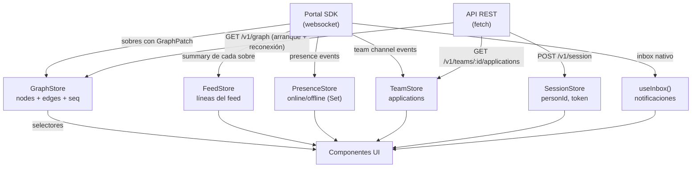

# 02 — Modelo de estado

> Cómo el frontend modela en memoria el grafo, las entidades, presence y el feed de actividad. Todo dato en vivo proviene de Portal; todo dato de arranque proviene de `GET /v1/graph`.

## Principio

El cliente **no** modela entidades de dominio como objetos independientes. El grafo ES el modelo. Los componentes leen del grafo y derivan vistas (personas, equipos, ideas) con selectores.

Esto es una consecuencia directa de [ADR-005 del backend](../docs/01-decisions.md#adr-005--postgres-es-la-fuente-de-verdad-portal-es-transporte): cada sobre lleva su `GraphPatch`, y el frontend aplica ese parche sin conocer el dominio.

## Store principal — `useGraphStore`

```ts
interface GraphStore {
  // === Estado ===
  nodes: Map<string, GraphNode>;
  edges: Map<string, GraphEdge>;
  lastSeq: number;
  isLoading: boolean;
  connectionStatus: 'idle' | 'connecting' | 'ready' | 'reconnecting' | 'degraded' | 'degraded-http' | 'blocked';

  // === Acciones ===
  loadSnapshot(snapshot: GraphSnapshot): void;
  applyPatch(patch: GraphPatch): void;
  setConnectionStatus(status: GraphStore['connectionStatus']): void;
}
```

Se usa `Map` en vez de objetos planos por rendimiento de lookup O(1) y por semántica de upsert/delete.

> **Nota:** los 7 estados de conexión son los reales de Portal (`room.status`). `"ready"` es el equivalente a "connected"; `"blocked"` es terminal (no hay reintento).

### GraphNode y GraphEdge

Directamente de `@nodo/contracts`:

```ts
type GraphNode = {
  id: string;
  kind: NodeKind;  // 'person' | 'idea' | 'team' | 'skill' | 'agent'
  label: string;
  status?: string;
  meta?: Record<string, unknown>;
};

type GraphEdge = {
  id: string;
  kind: EdgeKind;
  from: string;
  to: string;
  weight?: number;
  transient?: boolean;
  expiresAt?: number;
  meta?: Record<string, unknown>;
};
```

El frontend NO extiende estos tipos. Si necesita datos adicionales, los deriva del `meta` o de las relaciones del grafo.

## Selectores derivados

Los componentes no iteran el `Map` de nodos/aristas directamente. Usan selectores memoizados:

```ts
// Todas las personas
const persons = useGraphStore(s => 
  [...s.nodes.values()].filter(n => n.kind === 'person')
);

// Todos los equipos
const teams = useGraphStore(s => 
  [...s.nodes.values()].filter(n => n.kind === 'team')
);

// Skills de una persona
const personSkills = useGraphStore(s =>
  [...s.edges.values()].filter(e => e.kind === 'has_skill' && e.from === personId)
);

// Miembros de un equipo
const teamMembers = useGraphStore(s =>
  [...s.edges.values()]
    .filter(e => e.kind === 'member_of' && e.to === teamId)
    .map(e => s.nodes.get(e.from))
);

// Needs de un equipo
const teamNeeds = useGraphStore(s =>
  [...s.edges.values()].filter(e => e.kind === 'needs' && e.from === teamId)
);

// Sugerencias activas (transient, no expiradas, persona aún looking)
const activeSuggestions = useGraphStore(s =>
  [...s.edges.values()].filter(e => {
    if (e.kind !== 'suggested' || e.transient !== true) return false;
    if (e.expiresAt && e.expiresAt <= Date.now()) return false;
    // Filtro defensivo: si la persona ya no está looking, la sugerencia
    // no tiene sentido visual aunque el backend no haya publicado match.expired.
    const personNode = s.nodes.get(e.from);
    if (personNode && personNode.status !== 'looking') return false;
    return true;
  })
);
```

> **Nota sobre aristas expiradas en memoria:** el selector filtra correctamente por `expiresAt` y por status del nodo persona. Las aristas `suggested` cuyo `match.expired` no llegó (ej. cliente desconectado) permanecen en el `Map` de edges pero no se muestran. Ante reconexión con hueco de `seq`, `loadSnapshot` reemplaza el store completo y las limpia.
>
> **Filtro defensivo por status:** si el backend invalida sugerencias activamente al aceptar una solicitud (publicando `match.expired`), este filtro es redundante. Si no lo hace, evita mostrar sugerencias hacia personas que ya están `teamed` — un bug visual feo en la demo. Es la misma filosofía que el shallow merge en applyPatch: correcto en ambos escenarios posibles.

Para evitar re-renders innecesarios, se usan selectores con `shallow` comparison de Zustand o se memoizan con `useMemo` en el componente.

## Store de feed — `useFeedStore`

```ts
interface FeedStore {
  lines: FeedLine[];          // últimas 100 líneas; se trunca al insertar
  addLine(line: FeedLine): void;
  clear(): void;
}
```

El feed es cronológico (más reciente arriba). Se alimenta del `summary` de cada sobre que llega por `network-main`. `addLine` hace unshift + slice(0, 100) para mantener el tope.

```ts
type FeedLine = {
  text: string;            // "Laura creó el equipo Health AI"
  icon: string;            // emoji
  refs: Array<{ kind: NodeKind; id: string; label: string }>;
};
```

Los `refs` permiten enlazar al componente de detalle correspondiente (click en "Health AI" → navegar al equipo).

## Store de presence — `usePresenceStore`

```ts
interface PresenceStore {
  online: Set<string>;                  // personIds que están conectados
  setOnline(personId: string): void;
  setOffline(personId: string): void;
  replaceAll(personIds: string[]): void;
}
```

Se sincroniza con el presence nativo de Portal en `network-main`. El SDK expone quién entra/sale, y el store refleja eso.

**Solo online/offline.** Presence no lleva `status` de dominio (`looking`, `teamed`, `idle`). El status de una persona se lee siempre del `GraphNode.status`, que se actualiza vía `person.status_changed` en `network-main`.

> **Por qué no duplicar status aquí:** la metadata de presence se fija al conectar (join) y Portal no la re-emite cuando cambia el status de dominio del lado del backend. Si PresenceStore tuviera su propio `status`, divergiría del grafo cada vez que alguien pasa a `teamed` sin reconectarse. Leer siempre de `GraphNode.status` elimina esa fuente de bugs silenciosos.

**Uso en la UI:**
- Badge verde/gris en avatares: `presenceStore.online.has(personId)`.
- Contador "X personas en línea": `presenceStore.online.size`.
- En el grafo: nodos de personas online se resaltan visualmente.
- El `handle` y `displayName` para mostrar se leen del `GraphNode.label` o `meta`, no de presence.

## Store de sesión — `useSessionStore`

```ts
interface SessionStore {
  personId: string | null;
  sessionToken: string | null;
  isAuthenticated: boolean;
  
  // Perfil local (se carga de la respuesta de POST /v1/people o del grafo)
  profile: {
    handle: string;
    displayName: string;
    status: PersonStatus;
    teamId: string | null;
  } | null;

  setSession(personId: string, token: string): void;
  setProfile(profile: SessionStore['profile']): void;
  clearSession(): void;
}
```

Persistido en `localStorage` (solo `personId` y `sessionToken`). El perfil se rehidrata al arrancar desde el grafo o desde `GET /v1/people/:id`.

## Store de equipo — `useTeamStore`

```ts
interface TeamStore {
  // Solo se carga si el usuario pertenece a un equipo
  myTeamId: string | null;
  applications: ApplicationDTO[];       // solicitudes pendientes (si es líder)
  myApplication: ApplicationDTO | null; // solicitud propia (si es solicitante)

  setMyTeam(teamId: string | null): void;
  setApplications(apps: ApplicationDTO[]): void;
  updateApplication(app: ApplicationDTO): void;
}
```

Se alimenta del canal `team-{teamId}` y de REST (`GET /v1/teams/:id/applications`).

## Store de notificaciones — derivado de Portal `useInbox`

No se crea un store propio. Se usa directamente `useInbox` del SDK de Portal:

```ts
const { items, unseen, markAllRead } = useInbox();
```

Portal ya maneja la persistencia, deduplicación, y estado de leído.

## Relación entre stores



## Datos que NO se guardan en stores

| Dato | Por qué no |
|---|---|
| Lista de skills canónicos | Se obtiene una vez con `GET /v1/skills` y se cachea en un `useQuery` o variable de módulo. No cambia en runtime. |
| Detalle completo de una persona (`PersonDTO`) | Se obtiene bajo demanda (`GET /v1/people/:id`) al abrir un perfil. El grafo ya tiene `label`, `status` y `meta`. |
| Resultado de extracción de skills | Efímero, solo vive en el formulario de creación de perfil. |

## Consistencia eventual

El modelo acepta inconsistencias transitorias. Ejemplo:

1. El usuario acepta una solicitud (REST).
2. El backend hace commit + publica.
3. El sobre llega por Portal con el `GraphPatch`.
4. Solo entonces el store refleja `MEMBER_OF`.

Entre los pasos 1 y 4 (~150ms), el UI puede mostrar un optimistic update (ej. deshabilitar el botón, mostrar "Aceptando..."). Pero el estado real solo se consolida al recibir el parche.

**No se hace optimistic update del grafo.** Mutar el store antes de recibir el parche oficial rompe la idempotencia y puede causar estados fantasma si la operación REST falla. El delay es imperceptible (~150ms), así que se acepta.
