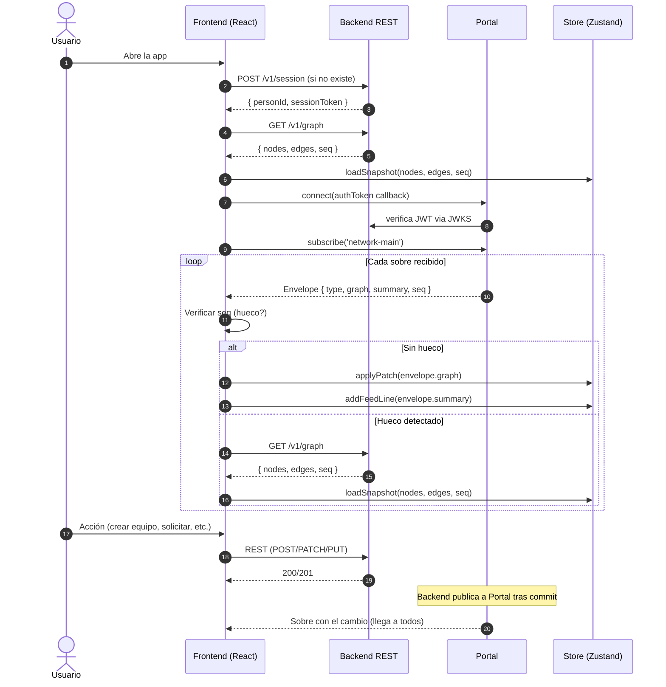

# 03 — Integración con Portal

> Este documento define **cómo el frontend consume Portal**. El contrato de canales, sobres y `authz` lo define el backend en [03-portal-contract](../docs/03-portal-contract.md) y [09-contracts](../docs/09-contracts.md). Aquí se describe la implementación del lado cliente.

## Secuencia de arranque

Obligatoria. Sin estos pasos el frontend no tiene datos ni tiempo real.

```
1. Verificar si existe sessionToken en localStorage
   → Si no: POST /v1/session → guardar { personId, sessionToken, recoveryCode }
   → Si sí: continuar con la sesión existente

2. GET /v1/graph
   → { nodes, edges, seq }
   → Cargar en el store Zustand con loadSnapshot()

3. Montar PortalProvider con token callback
   → El SDK conecta automáticamente al montar useChannel({ channelId: 'network-main' })
   → El callback token llama a POST /v1/portal/token internamente

4. useChannel({ channelId: 'network-main', onMessage: handler })
   → Portal hace backfill automático (history: 50)
   → El handler verifica seq y aplica parches con seq > snapshot.seq
```

**No hay un paso explícito de "subscribe".** Montar el componente que usa `useChannel` es lo que abre la conexión. Desmontar la cierra.

### Inicialización del SDK

```ts
import { Portal } from "@portalsdk/core";
import { PortalProvider } from "@portalsdk/react";

// Construir UNA VEZ, a nivel de módulo. Síncrono y pasivo.
const portal = new Portal({ apiKey: import.meta.env.VITE_PORTAL_PUBLIC_KEY });

async function fetchPortalToken(): Promise<string> {
  const res = await fetch(`${API_URL}/v1/portal/token`, {
    method: 'POST',
    headers: { Authorization: `Bearer ${getSessionToken()}` },
  });
  const { token } = await res.json();
  return token;
}

function App() {
  return (
    <PortalProvider client={portal} token={fetchPortalToken}>
      <RouterAndApp />
    </PortalProvider>
  );
}
```

**Punto crítico:** `token` es un callback `async`, nunca un string. El SDK lo reinvoca en conexión, reconexión y expiración. Si se pasa un string estático, a los 15 min aparece `TokenExpiredError` y el canal pasa a status `"blocked"`.

**Login/logout sin remount:** `portal.setToken(fetchPortalToken)` al hacer login, `portal.setToken(undefined)` al logout. El `PortalProvider` prop `token` ya forwadea a `setToken` internamente.

## Canales

### `network-main`

Canal principal. Todos los usuarios autenticados lo suscriben al montar la app.

**Qué llega:** todos los `MainEvent` definidos en `@nodo/contracts`:
- `person.upserted`
- `person.status_changed`
- `idea.published`
- `team.created`
- `team.updated`
- `team.member_joined`
- `team.member_left`
- `match.suggested`
- `match.expired`

**Qué hace el frontend con cada mensaje:**

1. Verificar `seq`: si `msg.seq > lastSeq + 1` → hueco detectado → re-fetch snapshot.
2. Si no hay hueco: actualizar `lastSeq = msg.seq`.
3. Aplicar `msg.graph` (el `GraphPatch`) al store Zustand con `applyPatch()`.
4. Añadir `msg.summary` (el `FeedLine`) al feed de actividad.
5. Si el `type` es relevante para algún componente específico (ej. `match.suggested` para la lista de sugerencias), actualizar la vista derivada.

**Señales efímeras que emite el cliente:**
- Presence (automática del SDK al suscribir).
- Typing indicators (si se implementa chat — fuera del MVP).

**El cliente NUNCA publica mensajes de dominio.** `publish: false` está configurado en `authz`. Toda escritura va por REST.

### `team-{teamId}`

Canal privado del equipo. Se suscribe **solo** cuando el usuario es miembro o tiene una solicitud activa.

**Qué llega:** `TeamEvent` definidos en `@nodo/contracts`:
- `application.created` (solo visible para miembros)
- `application.resolved`
- `team.need_changed`

**Qué hace el frontend:**
1. Actualizar la lista de solicitudes pendientes del equipo.
2. Mostrar notificación de nueva solicitud (si el usuario es el líder).
3. Actualizar estado de la solicitud del usuario (si es el solicitante y recibe `application.resolved`).

**Estos sobres NO llevan `graph`.** No afectan al grafo público.

**Suscripción y desuscripción:**
- Se suscribe al entrar a la vista de equipo o al ser aceptado en un equipo.
- Se desuscribe al salir del equipo.
- El `authz` del backend valida que el claim `teams` del JWT incluya el `teamId`. Si no, Portal rechaza la conexión al canal.

### Inbox (nativo de Portal)

No es un canal que se suscribe explícitamente. Se consume con `useInbox`.

**Qué llega:**
- Sugerencias del MatchMaker dirigidas al usuario (`match.suggested` con `to: [personId]`)
- Resolución de solicitudes (`application.resolved` con `to: [personId]`)
- Nuevas solicitudes al equipo que lidera (`application.created` con `to: [leadId]`)

## Presence

Presence vive en `network-main`. Es la única fuente de "quién está en línea".

**Presence solo indica online/offline.** No lleva status de dominio (`looking`, `teamed`, `idle`) porque Portal no re-emite la metadata de presence cuando el backend cambia `person.status`. El status de dominio se lee siempre del `GraphNode.status` en el `GraphStore`.

### DetailedPresence vs AggregatePresence

Portal expone dos modos de presence según el tamaño del canal:

- **`DetailedPresence`** (`{ kind: "detailed", participants, count }`): roster completo de quién está conectado. Permite `OnlineIndicator` por persona.
- **`AggregatePresence`** (`{ kind: "aggregate", count, recent }`): solo el conteo total y los últimos join/leave. NO da roster completo.

**El frontend DEBE verificar `presence.kind` antes de asumir roster completo:**

```ts
const { presence } = useChannel({ channelId: 'network-main' });
if (presence?.kind === 'detailed') {
  // Roster completo: marcar cada persona online/offline
  const onlineIds = new Set(presence.participants.map(p => p.id));
  presenceStore.replaceAll([...onlineIds]);
} else if (presence?.kind === 'aggregate') {
  // Solo counter: mostrar "X personas en línea" sin badges individuales
  // OnlineIndicator por persona NO es viable en este modo
}
```

> ⚠️ **PREGUNTA SIN RESOLVER:** ¿A partir de cuántos participantes concurrentes un canal pasa de Detailed a Aggregate? Para un hackathon (50-200 personas), ¿`network-main` caería en modo agregado? Si sí, el diseño de `OnlineIndicator` individual no es viable y hay que mostrar solo un contador global.

**Uso en la UI (si DetailedPresence):**
- Badge verde/gris en avatares del marketplace: `presenceStore.online.has(personId)`.
- Contador "X personas en línea" en el header: `presenceStore.online.size`.
- En el grafo: nodos de personas online se resaltan visualmente.

**Fallback (si AggregatePresence):**
- Solo contador global: `presence.count`.
- No hay badges individuales.
- El grafo no resalta nodos individuales por presencia.

**Limitación importante:** presence es exclusivamente websocket. El backend no puede leerlo. No se usa para lógica de negocio, solo para indicadores visuales.

## Aplicación de GraphPatch — Semántica de upsert

El `GraphPatch` es el mecanismo central. El frontend aplica parches **sin conocer el dominio**: no ramifica por `type` del sobre para decidir qué actualizar.

```ts
type GraphPatch = {
  nodes?: GraphNode[];       // upsert por id
  edges?: GraphEdge[];       // upsert por id
  removeNodes?: string[];
  removeEdges?: string[];
};
```

### Algoritmo de aplicación (en el store Zustand)

```
function applyPatch(patch: GraphPatch):
  1. Para cada node en patch.nodes:
     → Si existe un node con ese id: shallow merge (spread del existente + campos del parche)
     → Si no existe: insertar
  2. Para cada edge en patch.edges:
     → Si existe un edge con ese id: shallow merge (spread del existente + campos del parche)
     → Si no existe: insertar
  3. Para cada id en patch.removeNodes:
     → Eliminar el node
     → Eliminar todas las edges que lo referencian (from o to)
  4. Para cada id en patch.removeEdges:
     → Eliminar el edge
```

**Semántica: shallow merge, no replace.**

> ⚠️ **PREGUNTA PENDIENTE PARA EL BACKEND**
>
> ¿El backend garantiza que TODO `GraphPatch.nodes` incluye siempre el `GraphNode` completo (`id`, `kind`, `label`, `status`, `meta`), incluso cuando el evento de dominio solo cambió un campo (ej. `person.status_changed` que solo manda `{ personId, status, previous }` en su payload)?
>
> **Decisión tomada aquí:** usamos **shallow merge** (`{ ...existente, ...parche }`) en vez de reemplazo completo. Esto es defensivo: si el backend envía un nodo parcial (solo los campos que cambiaron), no se pierden `label` ni `meta` del nodo existente. Si el backend siempre envía el nodo completo, el merge produce el mismo resultado que un replace (porque todos los campos se sobrescriben). Es decir: merge es correcto en ambos casos, replace solo es correcto si el backend siempre manda el nodo completo.
>
> **Verificar durante integración:** si se confirma que el backend SIEMPRE envía `GraphNode` completos en el parche, se puede simplificar a replace. Hasta entonces, merge es la opción segura.

**Idempotencia:** reaplicar el mismo parche produce el mismo resultado. Esto importa porque Portal entrega *at-least-once*: un sobre puede llegar duplicado.

**Deduplicación:** se confía exclusivamente en el `seq` estrictamente creciente para descartar duplicados reales (entrega at-least-once de Portal). No se mantiene un Set de `envelope.id` procesados.

> ⚠️ **PREGUNTA PENDIENTE PARA EL BACKEND**
>
> En la publicación en dos fases de `match.suggested` (rationale de plantilla → rationale enriquecido), ¿el `envelope.id` (el id del evento, campo `id` del sobre) es el **MISMO** en ambas publicaciones, o cada publicación tiene su propio `envelope.id` y solo comparten el `edge.id` dentro del `GraphPatch`?
>
> **Por qué importa:** si ambas publicaciones comparten `envelope.id`, una deduplicación por Set de ids de sobre descartaría el segundo sobre completo y el rationale enriquecido nunca llegaría al cliente.
>
> **Decisión tomada aquí:** NO deduplicamos por `envelope.id`. Usamos solo `seq` para detectar duplicados y huecos:
> - `seq <= lastSeq` → duplicado real (at-least-once), ignorar.
> - `seq === lastSeq + 1` → aplicar normalmente.
> - `seq > lastSeq + 1` → hueco, re-fetch snapshot.
>
> Esto es correcto en ambos escenarios posibles:
> - Si las dos fases tienen **distinto** `envelope.id`: llegan con `seq` consecutivos distintos, ambas se aplican. El upsert del edge con mismo `edge.id` actualiza el rationale.
> - Si las dos fases tienen el **mismo** `envelope.id` pero **distinto** `seq`: también se aplican ambas (el `seq` es lo que discrimina). El upsert actualiza el rationale.
> - Duplicados reales de Portal (mismo sobre re-entregado): llegan con el **mismo** `seq`, se descartan por `seq <= lastSeq`.
>
> **Verificar durante integración:** confirmar cuál de los dos escenarios ocurre. Si el backend usa el mismo `envelope.id`, documentar explícitamente que el cliente NO deduplica por ese campo.

## Detección de huecos de `seq` y reconexión

Cada sobre trae un `seq` de Portal. El frontend mantiene `lastSeq` (inicializado desde el snapshot).

```
Al recibir un mensaje:
  si msg.seq <= lastSeq:
    → duplicado, ignorar
  si msg.seq === lastSeq + 1:
    → secuencia correcta, aplicar normalmente
    → lastSeq = msg.seq
  si msg.seq > lastSeq + 1:
    → HUECO detectado
    → Pedir GET /v1/graph de nuevo
    → Reemplazar el store completo con loadSnapshot()
    → lastSeq = snapshot.seq
    → Continuar aplicando sobres con seq > snapshot.seq
```

**¿Por qué no reconstruir desde el historial?** El backfill de Portal es de 50 mensajes. Si el cliente perdió la conexión más de unos minutos, 50 mensajes no alcanzan para reconstruir el grafo completo. El snapshot (`GET /v1/graph`) es la forma canónica de recuperarse.

**Reconexión del SDK:** Portal maneja reconexión automática. Al reconectar, hace backfill de los últimos mensajes. Si con ese backfill no se cubre el hueco, la lógica de arriba detecta el gap y pide el snapshot.

### Flujo visual durante reconexión (7 estados reales de Portal)

El canal expone `status` con 7 valores posibles. El `ConnectionBanner` mapea cada uno:

| Status de Portal | UI del banner | Notas |
|---|---|---|
| `idle` | — (no se muestra) | Handle creado pero no adquirido; no debería verse |
| `connecting` | "Conectando..." con spinner | Primer intento |
| `ready` | Banner oculto | Todo operativo |
| `reconnecting` | "Reconectando..." con spinner | Socket caído, reintentando |
| `degraded` | "Conexión inestable" (advertencia leve) | Parcialmente funcional |
| `degraded-http` | "Conexión inestable — tus acciones siguen funcionando" | Socket caído pero HTTP publish funciona; las acciones REST no se pierden |
| `blocked` | **"No se pudo conectar"** + acción (ej. "Reintentar" o "Volver a login") | **Terminal:** no hay reintento automático. NO mostrar spinner infinito. Causas: key inválida, baneado, no es miembro, canal lleno. |

**Lógica de re-fetch de snapshot:**
- Portal hace gap-fill automático al reconectar (replay de `last={seq}`).
- Si tras la reconexión el primer mensaje que llega tiene `seq > lastSeq + 1` (el gap-fill no cubrió), entonces sí se dispara `GET /v1/graph` para reconstruir.
- No se compara `seq` agresivamente en cada mensaje — solo tras una transición `reconnecting → ready` con gap visible.

1. Al pasar a `reconnecting`: mostrar banner.
2. Al volver a `ready`: verificar si el primer `seq` recibido post-reconexión cubre el gap.
3. Si no cubre: "Sincronizando..." mientras se pide el snapshot.
4. Al completar: se oculta el banner y el UI refleja el estado actual.
5. Las acciones REST siguen funcionando durante `reconnecting` y `degraded-http`.

## Manejo de expiración de sugerencias

Las aristas `suggested` llevan `expiresAt` (epoch ms). Dos mecanismos las limpian:

1. **Servidor:** publica `match.expired` con `removeEdges: [suggestionId]` cuando caduca. El parche las elimina.
2. **Cliente (cosmético):** un timer local oculta las aristas cuyo `expiresAt < Date.now()`, para no esperar al sobre del servidor y evitar mostrar sugerencias visualmente muertas.

## Publicación en dos fases del agente

El MatchMaker publica `match.suggested` dos veces con el mismo `edge.id` dentro del `GraphPatch`:
1. Primera: rationale de plantilla (llega rápido, ~150ms).
2. Segunda: rationale enriquecido por el LLM (~1s).

Desde el frontend, ambos sobres pasan el filtro de `seq` (son dos publicaciones distintas con `seq` consecutivos). El segundo sobre trae el mismo `edge.id` en su `GraphPatch`, y el shallow merge reemplaza los campos de la arista — incluyendo el `meta` que contiene el rationale actualizado. El componente que muestra el rationale simplemente re-renderiza con el texto nuevo.

> **Ver la pregunta pendiente de arriba** sobre si `envelope.id` es el mismo o distinto entre las dos fases. En cualquiera de los dos casos, la lógica basada en `seq` funciona correctamente y el upsert del edge aplica la actualización.

## Diagrama de flujo completo



## Error handling

| Escenario | Comportamiento |
|---|---|
| `POST /v1/portal/token` falla | Reintentar con backoff exponencial (3 intentos). Si falla: mostrar error y desactivar tiempo real. REST sigue disponible. |
| Token rechazado por Portal | El callback se reinvoca automáticamente. Si sigue fallando: probablemente el `sessionToken` expiró → pedir al usuario recrear sesión. |
| `GET /v1/graph` falla | Reintentar 3 veces. Si falla: mostrar estado de error. No suscribir al canal sin snapshot base. |
| Conexión websocket cae | El SDK reconecta automáticamente. Mostrar banner "Reconectando...". |
| Canal rechaza la conexión | `authz` devolvió block. Mostrar el mensaje de error de Portal al usuario. |

---

## ⚠️ Preguntas pendientes para el backend (consolidadas)

Estas preguntas deben resolverse durante la integración. Las decisiones defensivas están tomadas arriba, pero confirmar con el backend puede simplificar o corregir la implementación.

### 1. ¿GraphPatch siempre envía nodos/aristas completos?

**Contexto:** `person.status_changed` en su payload solo lleva `{ personId, status, previous }`. ¿El `GraphPatch` de ese mismo sobre incluye el `GraphNode` completo (`id`, `kind`, `label`, `status`, `meta`), o solo los campos que cambiaron?

**Decisión defensiva:** shallow merge (`{ ...existente, ...parche }`). Funciona correctamente en ambos casos.

**Si se confirma que siempre es completo:** se puede simplificar a replace, que es más fácil de razonar. No es urgente.

### 2. ¿Las dos fases de match.suggested comparten envelope.id?

**Contexto:** el MatchMaker publica dos veces con el mismo `edge.id` en el `GraphPatch`. ¿El campo `id` del `Envelope` (usado para idempotencia at-least-once) es el mismo en ambas publicaciones?

**Decisión defensiva:** no deduplicar por `envelope.id`. Solo usar `seq` para descartar duplicados y detectar huecos. El upsert del edge con mismo `edge.id` aplica la actualización del rationale en cualquiera de los dos escenarios.

**Si se confirma que son distintos `envelope.id`:** perfecto, no hay conflicto posible. Documentarlo y cerrar.

**Si se confirma que comparten `envelope.id`:** la decisión de no deduplicar por ese campo es correcta y obligatoria. Documentarlo como invariante del frontend.
