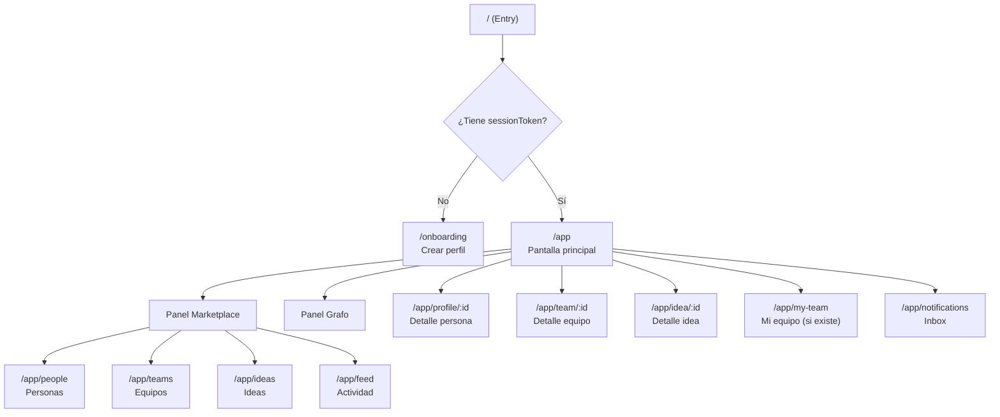

# 04 — Pantallas y componentes

## Mapa de pantallas



## Pantalla de Onboarding

**Ruta:** `/onboarding`
**Cuándo se muestra:** primera visita (no existe `sessionToken` en localStorage) o recuperación de sesión.

### Flujo

1. **Bienvenida** — Breve explicación de Nodo.
2. **Crear perfil** — Formulario con:
   - `displayName` (obligatorio)
   - `handle` (obligatorio, único)
   - `headline` (opcional)
   - `bioRaw` (texto libre, opcional — dispara extracción de skills)
   - `skills` (selección manual con autocompletado, se precargan de `GET /v1/skills`)
   - `availability` (full | partial | evenings)
   - `language` (es | en)
3. **Preview de skills** — Si el usuario escribe `bioRaw`, se llama a `POST /v1/skills/extract` para previsualizar los skills detectados antes de guardar.
4. **Guardar** — `POST /v1/session` + `POST /v1/people` en secuencia.
5. **Mostrar recoveryCode** — Una sola vez, con instrucción de guardarlo.
6. **Redirigir a `/app`**.

### Componentes

| Componente | Responsabilidad |
|---|---|
| `OnboardingPage` | Layout y flujo multi-step |
| `ProfileForm` | Formulario de perfil |
| `SkillPicker` | Autocompletado multiselect de skills canónicos |
| `SkillPreview` | Muestra skills extraídos del bio con badges |
| `RecoveryCodeModal` | Muestra el código y confirma que el usuario lo guardó |

---

## Pantalla principal — Layout

**Ruta:** `/app`

### Estructura (desktop)

```
┌─────────────────────────────────────────────────────────┐
│  Header: Logo · Tabs · Presence counter · Notifications │
├───────────────────────────────┬─────────────────────────┤
│                               │                         │
│      Marketplace Panel        │      Graph Panel        │
│      (lista/cards)            │      (force-graph)      │
│                               │                         │
│  [Personas|Equipos|Ideas|Feed]│                         │
│                               │                         │
└───────────────────────────────┴─────────────────────────┘
```

### Estructura (móvil)

```
┌─────────────────────┐
│  Header             │
├─────────────────────┤
│                     │
│   Content Area      │
│   (una vista)       │
│                     │
├─────────────────────┤
│ [🧑 | 🏢 | 💡 | 📊 | 🔔] │
│  Bottom tabs        │
└─────────────────────┘
```

---

## Panel Marketplace

### Sub-vista: Personas (`/app/people`)

**Muestra:** todas las personas de la red, con sus skills y disponibilidad. Por defecto se filtran las `looking` (las que buscan equipo), pero un toggle permite ver también `teamed` e `idle`.

| Componente | Responsabilidad |
|---|---|
| `PeopleList` | Lista/grid de tarjetas de personas |
| `PersonCard` | Nombre, handle, headline, skills (badges), status, indicador online |
| `StatusBadge` | Color según `looking` (verde), `teamed` (azul), `idle` (gris). Se reutiliza en `MembersList` y `ProfileHeader`. |
| `OnlineIndicator` | Punto verde si está en presence |

**Datos:** selectores del `GraphStore` filtrando nodos `kind === 'person'` + aristas `has_skill`. Presence del `PresenceStore`.

### Sub-vista: Equipos (`/app/teams`)

**Muestra:** equipos de la red con su estado, miembros, necesidades.

| Componente | Responsabilidad |
|---|---|
| `TeamsList` | Lista de tarjetas de equipos |
| `TeamCard` | Nombre, pitch, status badge, miembros (avatares), needs (badges), slots libres |
| `TeamStatusBadge` | Color por estado: recruiting (verde), almost_full (amarillo), complete (azul), building (morado) |
| `NeedBadge` | Skill badge con indicación required/nice |

**Datos:** nodos `kind === 'team'` + aristas `member_of`, `needs`, `leads`.

### Sub-vista: Ideas (`/app/ideas`)

| Componente | Responsabilidad |
|---|---|
| `IdeasList` | Lista de ideas publicadas |
| `IdeaCard` | Título, resumen, autor, interesados count, badge si ya tiene equipo |

### Sub-vista: Feed de actividad (`/app/feed`)

**Muestra:** líneas cronológicas de todo lo que pasa en la red.

| Componente | Responsabilidad |
|---|---|
| `ActivityFeed` | Lista cronológica (más reciente arriba) |
| `FeedLine` | Icono + texto + enlaces a entidades (refs) |

**Datos:** `FeedStore.lines`. Cada línea viene del `summary` de los sobres de Portal.

---

## Panel de Grafo

**Siempre visible** en desktop (lado derecho). En móvil es un tab.

| Componente | Responsabilidad |
|---|---|
| `GraphPanel` | Contenedor de react-force-graph-2d |
| `nodeCanvasObject` callback | Renderiza cada nodo según `kind`: persona (círculo azul), equipo (cuadrado verde), idea (diamante amarillo), skill (punto gris), agente (estrella morada) |
| `linkCanvasObject` callback | Renderiza aristas: sólidas para relaciones permanentes, punteadas+animadas para `transient: true` |
| `GraphControls` | Zoom, fit, filtros por tipo de nodo |

**Mapping de kinds a estilos visuales:**

| `GraphNode.kind` | Forma | Color base |
|---|---|---|
| `person` | círculo | azul |
| `team` | cuadrado redondeado | verde |
| `idea` | diamante | amarillo |
| `skill` | punto pequeño | gris |
| `agent` | estrella | morado |

**Mapping de aristas:**

| `GraphEdge.kind` | Estilo |
|---|---|
| `has_skill` | línea fina gris, baja opacidad |
| `needs` | línea fina naranja (required) / gris punteada (nice) |
| `member_of` | línea sólida verde |
| `leads` | línea sólida verde, más gruesa |
| `interested_in` | línea fina amarilla |
| `authored` | línea fina amarilla |
| `spawned` | línea sólida amarilla |
| `applied_to` | línea punteada azul |
| `suggested` | **línea punteada animada morada** (el diferenciador visual del MatchMaker) |

**Interacción:**
- Zoom y pan (scroll + drag en canvas).
- Click en nodo → navegar al detalle de la entidad (`onNodeClick`).
- **Click en arista `suggested`** → abrir `SuggestionCard` con el detalle de esa sugerencia (`onLinkClick`, filtrando por `edge.kind === 'suggested'`). Las demás aristas no reaccionan a click.
- Hover en nodo → resaltar nodo + sus conexiones directas (dim de los demás).
- Drag en nodo → reposicionar manualmente (la física se adapta).
- Filtro por tipo de nodo (toggle checkboxes): filtra **nodos y aristas a la vez** (ver nota abajo).
- El grafo se re-estabiliza con animación orgánica al añadir/quitar nodos o aristas.

**Filtrado consistente de nodos y aristas:**

> Al desactivar un tipo de nodo (ej. `skill`), se excluyen del array de datos tanto los nodos de ese tipo como **todas las aristas cuyos extremos (`from` o `to`) apunten a un nodo excluido**. Si solo se filtran nodos sin filtrar aristas, react-force-graph-2d recibe links con referencias inválidas y puede crashear o comportarse de forma impredecible. El hook `useGraphData` que transforma el store en `{ nodes, links }` aplica ambos filtros atómicamente.

**Comportamiento al recibir un GraphPatch:**
- Al insertar un nodo: aparece en la simulación y la física lo acomoda orgánicamente.
- Al eliminar un nodo: desaparece y sus vecinos se reajustan.
- Al insertar una arista `suggested`: la conexión punteada aparece con animación de la física.
- Al eliminar una arista (`match.expired`): desaparece y los nodos se separan suavemente.

---

## Pantallas de detalle

### Perfil de persona (`/app/profile/:id`)

| Componente | Responsabilidad |
|---|---|
| `ProfilePage` | Layout con info + acciones |
| `ProfileHeader` | Avatar, nombre, handle, headline, status, online indicator |
| `SkillsList` | Skills con level (1-3 como dots o estrellas) |
| `ProfileActions` | Si es mi perfil: editar. Si no: ver sugerencias comunes. |

**Datos:** `GET /v1/people/:id` para detalle completo + grafo para relaciones.

### Detalle de equipo (`/app/team/:id`)

| Componente | Responsabilidad |
|---|---|
| `TeamPage` | Layout completo del equipo |
| `TeamHeader` | Nombre, pitch, status, líder |
| `MembersList` | Avatares + roles de miembros actuales |
| `NeedsList` | Skills que busca (required vs nice) |
| `ApplyButton` | Muestra uno de 3 estados según `TeamStore.myApplication` (ver detalle abajo) |
| `ApplicationMessage` | Textarea para el mensaje de solicitud |

**Estados de `ApplyButton`:**

| Condición | Estado visual | Comportamiento |
|---|---|---|
| No es miembro, no tiene equipo, no tiene solicitud a este equipo | "Solicitar unirme" (habilitado) | Click → mostrar `ApplicationMessage` → `POST /v1/teams/:id/applications` |
| `myApplication.teamId === este equipo` && `status === 'pending'` | "Solicitud enviada" (deshabilitado, gris) | Muestra "Esperando respuesta del líder". Opción de retirar (`POST /v1/applications/:id/withdraw`). |
| `myApplication.status === 'auto_rejected'` (para este equipo) | "Solicitud rechazada automáticamente" + botón re-habilitado si el equipo sigue `recruiting` | Mensaje breve: "Fuiste aceptado en otro equipo". Si la persona vuelve a `looking` y el equipo sigue reclutando, puede re-aplicar. |
| La persona ya está en un equipo (`status === 'teamed'`) | "Ya tienes equipo" (deshabilitado) | Tooltip explicativo. No se puede aplicar. |

> **Relación con AC-04:** cuando el líder acepta una solicitud, las demás `pending` de esa persona pasan a `auto_rejected`. El frontend recibe `application.resolved` por los canales de equipo correspondientes, actualizando `TeamStore.myApplication`. El `ApplyButton` en otros equipos cambia de "Solicitud enviada" a "Rechazada automáticamente" en vivo.

**Si es el líder:**
| Componente | Responsabilidad |
|---|---|
| `ApplicationsPanel` | Lista de solicitudes pendientes |
| `ApplicationCard` | Persona + skills + mensaje + botones aceptar/rechazar |
| `EditNeedsForm` | Editar necesidades del equipo |

### Mi equipo (`/app/my-team`)

Redirecciona a `/app/team/:myTeamId` si existe. Si no, muestra opciones:
- "Crear equipo"
- "Buscar equipo"

### Detalle de idea (`/app/idea/:id`)

| Componente | Responsabilidad |
|---|---|
| `IdeaPage` | Título, resumen, autor, interesados |
| `InterestedButton` | Toggle "Me interesa" |
| `CreateTeamFromIdea` | Si es el autor y no tiene equipo derivado: "Crear equipo" |

---

## Pantalla de notificaciones (`/app/notifications`)

| Componente | Responsabilidad |
|---|---|
| `NotificationsPage` | Lista de inbox items |
| `NotificationItem` | Título + data + timestamp + indicador de leído |
| `NotificationBell` | En el header: icono + badge con `unseen` count |

---

## Modales y overlays

| Componente | Se abre desde | Propósito |
|---|---|---|
| `CreateTeamModal` | Botón en marketplace o en "Mi equipo" | Formulario para crear equipo |
| `PublishIdeaModal` | Botón en marketplace de ideas | Formulario para publicar idea |
| `EditProfileModal` | Botón en mi perfil | Editar perfil existente |
| `SuggestionCard` | Feed, inbox, o arista en el grafo | Detalle de una sugerencia del MatchMaker (rationale, score, skills coincidentes, botón "Solicitar unirme") |
| `RecoveryModal` | Settings | Introducir recovery code para restaurar sesión |

---

## Componentes base reutilizables

| Componente | Uso |
|---|---|
| `Button` | Primario, secundario, ghost, danger |
| `Card` | Contenedor con padding y sombra |
| `Badge` | Tags de skills, estados |
| `Avatar` | Iniciales + indicador online |
| `Modal` | Overlay con backdrop |
| `Toast` | Notificaciones efímeras (react-hot-toast) |
| `Spinner` | Loading states |
| `EmptyState` | Placeholder cuando no hay datos |
| `ErrorBoundary` | Catch de errores de rendering |
