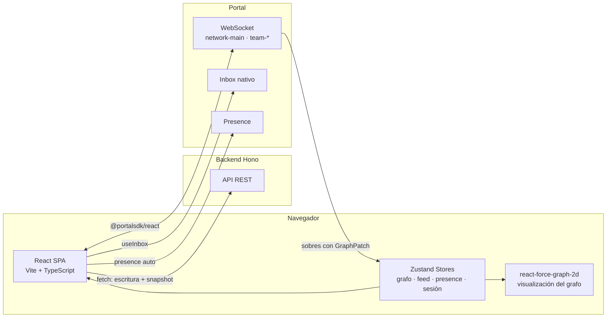
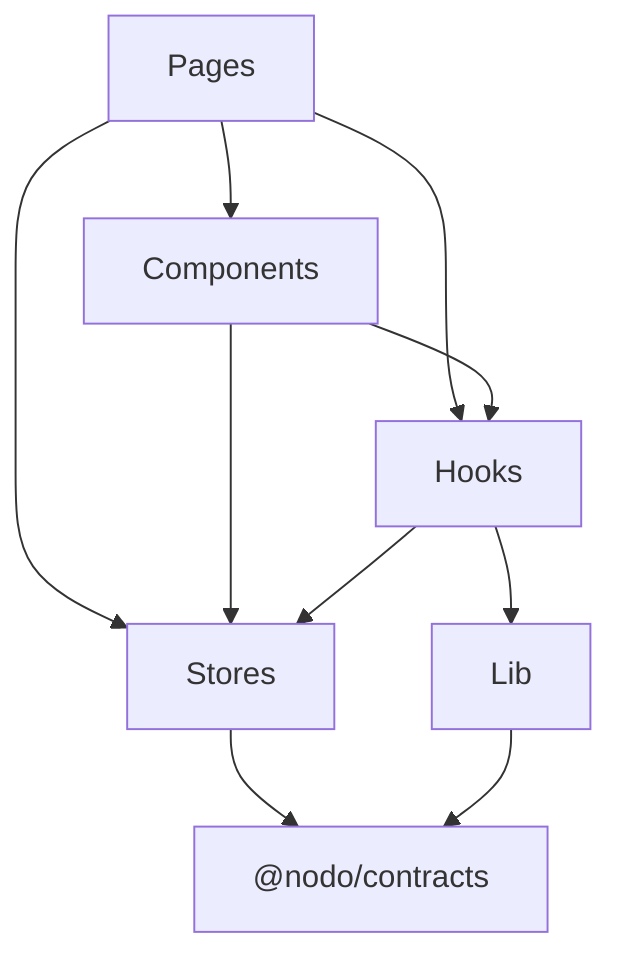

# 07 — Arquitectura frontend

## Vista general



## Estructura de carpetas

```
src/
├── main.tsx                    # entry point
├── App.tsx                     # PortalProvider + Router + Layout
│
├── lib/                        # utilidades y configuración
│   ├── api.ts                  # cliente HTTP tipado (wrapper de fetch)
│   ├── portal.ts               # configuración del SDK de Portal
│   └── constants.ts            # env vars, magic numbers
│
├── stores/                     # estado global (Zustand)
│   ├── graphStore.ts           # nodos, aristas, seq, applyPatch, loadSnapshot
│   ├── feedStore.ts            # líneas del feed de actividad
│   ├── presenceStore.ts        # quién está online
│   ├── sessionStore.ts         # personId, sessionToken, perfil
│   └── teamStore.ts            # applications del equipo del usuario
│
├── hooks/                      # custom hooks
│   ├── usePortalChannel.ts     # suscripción a network-main: verifica seq, aplica patch, alimenta feed
│   ├── useTeamChannel.ts       # suscripción a team-{teamId}
│   ├── useGraphSelectors.ts    # selectores memoizados del grafo
│   ├── useApi.ts               # helpers para llamadas REST con error handling
│   └── useGraphData.ts         # transforma store → { nodes, links } para react-force-graph
│
├── components/                 # componentes de UI
│   ├── base/                   # componentes reutilizables
│   │   ├── Button.tsx
│   │   ├── Card.tsx
│   │   ├── Badge.tsx
│   │   ├── Avatar.tsx
│   │   ├── Modal.tsx
│   │   ├── Spinner.tsx
│   │   ├── EmptyState.tsx
│   │   └── ErrorBoundary.tsx
│   │
│   ├── graph/                  # visualización del grafo (react-force-graph)
│   │   ├── GraphPanel.tsx          # wrapper de ForceGraph2D + controles
│   │   ├── useGraphData.ts         # transforma store → { nodes, links } para force-graph
│   │   ├── nodeRenderer.ts         # callback nodeCanvasObject por kind
│   │   ├── linkRenderer.ts         # callback linkCanvasObject (punteada para transient)
│   │   └── GraphControls.tsx       # filtros, zoom, fit
│   │
│   ├── marketplace/            # listas y cards del marketplace
│   │   ├── PeopleList.tsx
│   │   ├── PersonCard.tsx
│   │   ├── TeamsList.tsx
│   │   ├── TeamCard.tsx
│   │   ├── IdeasList.tsx
│   │   ├── IdeaCard.tsx
│   │   └── ActivityFeed.tsx
│   │
│   ├── team/                   # componentes de equipo
│   │   ├── ApplicationsPanel.tsx
│   │   ├── ApplicationCard.tsx
│   │   ├── MembersList.tsx
│   │   ├── NeedsList.tsx
│   │   ├── EditNeedsForm.tsx
│   │   └── ApplyButton.tsx
│   │
│   ├── profile/                # componentes de perfil
│   │   ├── ProfileForm.tsx
│   │   ├── SkillPicker.tsx
│   │   ├── SkillPreview.tsx
│   │   └── StatusToggle.tsx
│   │
│   ├── notifications/          # inbox y toasts
│   │   ├── NotificationBell.tsx
│   │   ├── NotificationItem.tsx
│   │   └── SuggestionCard.tsx
│   │
│   └── layout/                 # estructura general
│       ├── Header.tsx
│       ├── MainLayout.tsx
│       ├── MarketplacePanel.tsx
│       ├── MobileNav.tsx
│       └── ConnectionBanner.tsx
│
├── pages/                      # componentes de ruta
│   ├── OnboardingPage.tsx
│   ├── AppPage.tsx             # layout principal con panels
│   ├── ProfilePage.tsx
│   ├── TeamPage.tsx
│   ├── IdeaPage.tsx
│   ├── MyTeamPage.tsx
│   └── NotificationsPage.tsx
│
└── types/                      # tipos locales (NO de dominio)
    └── ui.ts                   # tipos de UI propios (no duplican @nodo/contracts)
```

## Reglas de dependencias



| Regla | Detalle |
|---|---|
| `stores/` no importa `components/` ni `pages/` | El estado no conoce la UI |
| `lib/` no importa nada del proyecto | Solo usa `@nodo/contracts` y env vars |
| `components/base/` no importa stores | Recibe datos por props, es reutilizable |
| Los tipos de dominio vienen de `@nodo/contracts` | Nunca se redefinen localmente |
| `types/ui.ts` solo contiene tipos de presentación | Ej. opciones de filtro, estados de formulario |

## Gestión de estado — resumen

| Store | Contenido | Fuente | Frecuencia de actualización |
|---|---|---|---|
| `graphStore` | Nodos + aristas + seq | `GET /v1/graph` + Portal (GraphPatch) | Cada sobre (~segundos) |
| `feedStore` | Líneas del feed | Portal (summary) | Cada sobre |
| `presenceStore` | Quién está online (Set de IDs) | Portal (presence) | join/leave |
| `sessionStore` | personId, token, perfil | localStorage + REST | Una vez al arrancar |
| `teamStore` | Applications del equipo | REST + Portal (team channel) | Poco frecuente |

## Flujo de datos

```
┌─────────────────────────────────────────────────┐
│                    Portal SDK                     │
│  (websocket, reconexión automática, presence)    │
└─────────────────────┬───────────────────────────┘
                      │ sobres (Envelope<T, P>)
                      ▼
┌─────────────────────────────────────────────────┐
│              usePortalChannel hook                │
│  1. Verifica seq (hueco? duplicado?)             │
│     - seq <= lastSeq → ignorar (duplicado)       │
│     - seq > lastSeq + 1 → re-fetch snapshot      │
│  2. Extrae graph + summary                       │
└──────┬──────────────────────┬───────────────────┘
       │                      │
       ▼                      ▼
┌──────────────┐    ┌─────────────────┐
│  GraphStore  │    │   FeedStore     │
│ applyPatch() │    │  addLine()      │
└──────┬───────┘    └─────────────────┘
       │
       ▼
┌──────────────────────────────────────┐
│         Componentes (selectores)      │
│  - GraphPanel (react-force-graph)     │
│  - PeopleList / TeamsList             │
│  - PersonCard / TeamCard              │
└──────────────────────────────────────┘
```

## Convenciones

### Nomenclatura

| Tipo | Convención | Ejemplo |
|---|---|---|
| Componentes | PascalCase | `PersonCard.tsx` |
| Hooks | camelCase con `use` prefix | `useGraphSelectors.ts` |
| Stores | camelCase con `Store` suffix | `graphStore.ts` |
| Utilidades | camelCase | `api.ts` |
| Constantes | UPPER_SNAKE_CASE | `API_URL` |

### Archivos

- Un componente por archivo.
- Los componentes exportan con `export function`, no con `export default`.
- Los stores exportan el hook de Zustand como named export.
- Los archivos `index.ts` solo en carpetas que lo ameriten para barrel exports.

### TypeScript

- `strict: true` en `tsconfig.json`.
- No `any`. Si el tipo es desconocido: `unknown` + type guard.
- Los tipos de dominio se importan de `@nodo/contracts`. Nunca se redefinen.
- Los tipos de UI (estados de formulario, opciones de filtro) van en `types/ui.ts`.

### Estilo de código

- Functional components (no clases).
- Hooks para lógica reutilizable.
- `async/await` (no `.then()`).
- Early returns para guard clauses.
- Comentarios solo cuando el "por qué" no es obvio del código.

## Optimización de rendimiento

| Técnica | Dónde aplica |
|---|---|
| Selectores granulares de Zustand | Evitar que un cambio en un nodo re-renderice toda la lista |
| Canvas rendering (react-force-graph) | El grafo usa Canvas, no SVG/DOM — rinde bien hasta ~2000 nodos |
| Virtualización (si es necesario) | Listas de personas/equipos si crecen mucho |
| `useMemo` para derivaciones costosas | Transformación store → graphData para force-graph |
| Debounce en inputs de búsqueda/filtro | Evitar re-filtrar en cada keystroke |
| `cooldownTicks` en force-graph | Detener la simulación de fuerzas después de estabilizar, para no consumir CPU idle |

## Deploy

Build estático con Vite:

```bash
pnpm build     # genera dist/
```

El resultado es HTML/JS/CSS que se sirve desde:
- Railway (static site) o
- Vercel, Netlify, Cloudflare Pages, o cualquier CDN.

Variables de entorno necesarias en build time:
- `VITE_PORTAL_PUBLIC_KEY`
- `VITE_API_URL`

No hay server-side runtime. El frontend es completamente estático.
